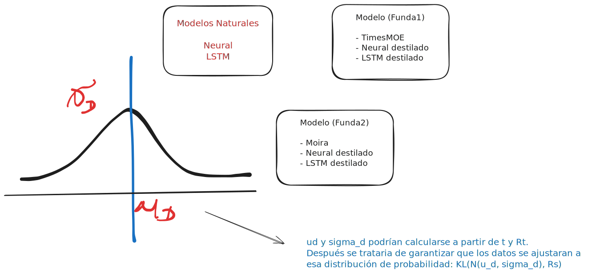

# Experimentos 

## Método propuesto KL based loss

## Descripción Folders

### 1. Baseline

Contiene las funciones principales que estaremos usando en todo el proyecto, además contiene el entrenamiento base para la arquitectura __LSTM__.

### 2. Data

Este folder contiene la nuestros datasets y los notebooks donde se hace el entrenamiento de los modelos destilados de la misma forma este notebook es el que debe contener el repo de __Time_MoE__ y funciones para testear el conjunto de datos de Time-300B.

### 3. neural_odes

De manera similar al primer folder contiene el entrenamiento para la arquitectura de Neural ODES.

### 4. Resultados

Contiene un notebook con los resultados preliminares de los modelos base además del modelo Teacher

### 5. Dataset Covid-19 Colombia

[link](https://drive.google.com/file/d/1xzLJaZhnl95UFijZLBkQuTgaCnCDTyRQ/view?usp=sharing)